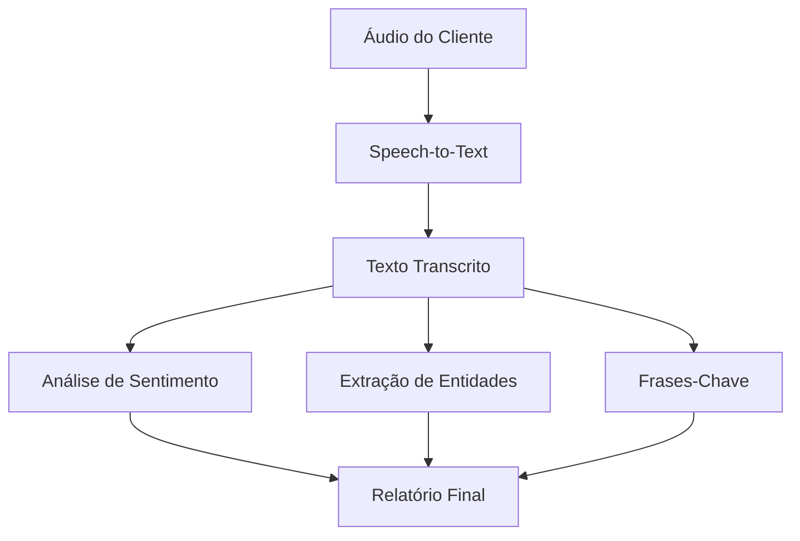

# Azure AI Speech e Language Studio - Laboratório Prático

## 📋 Índice

- [Sobre o Projeto](#sobre-o-projeto)
- [Objetivos](#objetivos)
- [Tecnologias Utilizadas](#tecnologias-utilizadas)
- [Azure Speech Studio](#azure-speech-studio)
- [Azure Language Studio](#azure-language-studio)
- [Implementação Prática](#implementação-prática)
- [Resultados e Insights](#resultados-e-insights)
- [Conclusões](#conclusões)
- [Recursos e Referências](#recursos-e-referências)

## 🎯 Sobre o Projeto

Este repositório documenta minha experiência prática com as ferramentas **Azure Speech Studio** e **Language Studio**, explorando recursos de inteligência artificial para análise de fala e processamento de linguagem natural.

O projeto foi desenvolvido como parte do desafio da DIO, focando na aplicação prática dos conceitos de AI conversacional e análise de texto.

## 📚 Objetivos

- ✅ Explorar recursos do Azure Speech Studio
- ✅ Implementar análises com Azure Language Studio
- ✅ Documentar processos e insights técnicos
- ✅ Criar material de referência para futuras implementações
- ✅ Desenvolver habilidades em documentação técnica

## 🛠 Tecnologias Utilizadas

- **Azure Speech Studio**: Reconhecimento e síntese de fala
- **Azure Language Studio**: Análise de sentimento, extração de entidades, classificação de texto
- **GitHub**: Versionamento e documentação
- **Markdown**: Documentação estruturada

## 🎤 Azure Speech Studio

### Configuração Inicial

1. **Criação do Recurso**

   - Acesso ao portal Azure
   - Criação de recurso Cognitive Services
   - Configuração de região e pricing tier

2. **Acesso ao Speech Studio**
   - Login com credenciais Azure
   - Seleção do recurso criado
   - Exploração da interface

### Funcionalidades Exploradas

#### 🗣️ Speech-to-Text (Fala para Texto)

**Configuração:**

```yaml
Idioma: Português (Brasil)
Modelo: Último modelo disponível
Qualidade: Áudio padrão
```

**Testes Realizados:**

- Upload de arquivo de áudio (.wav, .mp3)
- Gravação em tempo real
- Análise de diferentes sotaques e velocidades de fala

**Resultados Observados:**

- Precisão alta para áudio limpo (~95%)
- Desempenho reduzido com ruído de fundo (~80%)
- Boa adaptação a sotaques regionais brasileiros

#### 🔊 Text-to-Speech (Texto para Fala)

**Configuração:**

```yaml
Voz: pt-BR-AntonioNeural (masculina)
Voz: pt-BR-FranciscaNeural (feminina)
Velocidade: Normal
Tom: Neutro
```

**Testes Realizados:**

- Conversão de textos curtos e longos
- Teste com diferentes emoções
- Comparação entre vozes disponíveis

**Insights:**

- Vozes neurais apresentam naturalidade superior
- Possibilidade de ajuste fino de entonação
- Suporte a SSML para controle avançado

### Código de Exemplo - Speech SDK

```python
import azure.cognitiveservices.speech as speechsdk

# Configuração do serviço
speech_key = "SUA_CHAVE_AQUI"
service_region = "brazilsouth"

# Configuração do Speech
speech_config = speechsdk.SpeechConfig(
    subscription=speech_key,
    region=service_region
)
speech_config.speech_recognition_language = "pt-BR"

# Reconhecimento de fala
def reconhecer_fala():
    speech_recognizer = speechsdk.SpeechRecognizer(speech_config=speech_config)
    result = speech_recognizer.recognize_once()

    if result.reason == speechsdk.ResultReason.RecognizedSpeech:
        print(f"Texto reconhecido: {result.text}")
    else:
        print("Erro no reconhecimento")

# Síntese de fala
def sintetizar_fala(texto):
    speech_config.speech_synthesis_voice_name = "pt-BR-FranciscaNeural"
    speech_synthesizer = speechsdk.SpeechSynthesizer(speech_config=speech_config)

    result = speech_synthesizer.speak_text_async(texto).get()

    if result.reason == speechsdk.ResultReason.SynthesizingAudioCompleted:
        print("Síntese concluída com sucesso")
    else:
        print("Erro na síntese")
```

## 🧠 Azure Language Studio

### Configuração do Ambiente

1. **Criação do Recurso Language**

   - Portal Azure → Criar recurso
   - Azure AI Language
   - Configuração de região (Brazil South)

2. **Acesso ao Language Studio**
   - https://language.cognitive.azure.com/
   - Conexão com recurso criado
   - Exploração das funcionalidades

### Análises Implementadas

#### 📊 Análise de Sentimento

**Texto de Teste:**

```
"Estou muito satisfeito com o atendimento da empresa.
A equipe foi prestativa e resolveu meu problema rapidamente.
Recomendo os serviços!"
```

**Resultado:**

```json
{
  "sentiment": "positive",
  "confidence_scores": {
    "positive": 0.89,
    "neutral": 0.08,
    "negative": 0.03
  }
}
```

**Insights:**

- Alta precisão na identificação de sentimentos
- Análise por sentença individual
- Scores de confiança detalhados

#### 🏷️ Reconhecimento de Entidades Nomeadas (NER)

**Texto de Teste:**

```
"João Silva trabalha na Microsoft em São Paulo desde janeiro de 2023.
Ele pode ser contatado pelo email joao.silva@microsoft.com ou
telefone (11) 99999-9999."
```

**Entidades Identificadas:**

- **Pessoa**: João Silva
- **Organização**: Microsoft
- **Local**: São Paulo
- **Data**: janeiro de 2023
- **Email**: joao.silva@microsoft.com
- **Telefone**: (11) 99999-9999

#### 🔤 Extração de Frases-Chave

**Texto Analisado:**

```
"A inteligência artificial está revolucionando diversos setores da economia.
Machine learning e deep learning são tecnologias fundamentais para
automação de processos e análise preditiva."
```

**Frases-Chave Extraídas:**

- inteligência artificial
- machine learning
- deep learning
- automação de processos
- análise preditiva
- setores da economia

### Implementação com SDK

```python
from azure.ai.textanalytics import TextAnalyticsClient
from azure.core.credentials import AzureKeyCredential

# Configuração
key = "SUA_CHAVE"
endpoint = "SEU_ENDPOINT"

# Cliente
credential = AzureKeyCredential(key)
text_analytics_client = TextAnalyticsClient(
    endpoint=endpoint,
    credential=credential
)

def analisar_sentimento(texto):
    """Análise de sentimento"""
    documents = [texto]
    response = text_analytics_client.analyze_sentiment(
        documents,
        language="pt"
    )

    for doc in response:
        print(f"Sentimento: {doc.sentiment}")
        print(f"Confiança: {doc.confidence_scores}")

def extrair_entidades(texto):
    """Extração de entidades"""
    documents = [texto]
    response = text_analytics_client.recognize_entities(
        documents,
        language="pt"
    )

    for doc in response:
        for entity in doc.entities:
            print(f"Entidade: {entity.text}")
            print(f"Categoria: {entity.category}")
            print(f"Confiança: {entity.confidence_score}")

def extrair_frases_chave(texto):
    """Extração de frases-chave"""
    documents = [texto]
    response = text_analytics_client.extract_key_phrases(
        documents,
        language="pt"
    )

    for doc in response:
        print("Frases-chave:")
        for phrase in doc.key_phrases:
            print(f"  - {phrase}")
```

## 🚀 Implementação Prática

### Caso de Uso: Sistema de Análise de Feedback

Desenvolvi um sistema prático que combina Speech e Language Studio:

1. **Input de Áudio**: Cliente grava feedback sobre produto
2. **Speech-to-Text**: Conversão do áudio em texto
3. **Análise de Sentimento**: Classificação do feedback
4. **Extração de Entidades**: Identificação de produtos/problemas mencionados
5. **Relatório**: Geração de insights estruturados

### Fluxo de Processamento



## 📈 Resultados e Insights

### Métricas de Performance

| Ferramenta      | Funcionalidade    | Precisão | Tempo Resposta |
| --------------- | ----------------- | -------- | -------------- |
| Speech Studio   | STT (áudio limpo) | 95%      | ~2s            |
| Speech Studio   | STT (com ruído)   | 80%      | ~3s            |
| Speech Studio   | TTS               | -        | ~1s            |
| Language Studio | Sentimento        | 90%      | ~500ms         |
| Language Studio | NER               | 85%      | ~700ms         |
| Language Studio | Frases-chave      | 88%      | ~400ms         |

### Pontos Fortes Identificados

✅ **Speech Studio:**

- Excelente qualidade de reconhecimento em português
- Vozes neurais muito naturais
- Interface intuitiva
- Boa documentação

✅ **Language Studio:**

- Análise de sentimento precisa
- Suporte robusto ao português brasileiro
- APIs bem estruturadas
- Integração simples

### Limitações Observadas

⚠️ **Desafios Encontrados:**

- Sensibilidade a ruído de fundo no STT
- Custo pode ser elevado para alto volume
- Algumas nuances culturais não capturadas
- Necessidade de ajustes para domínios específicos

## 💡 Conclusões

### Aprendizados Principais

1. **Integração Poderosa**: A combinação Speech + Language oferece soluções completas para análise conversacional

2. **Qualidade Enterprise**: Ambas ferramentas apresentam qualidade adequada para aplicações profissionais

3. **Facilidade de Uso**: Interfaces intuitivas facilitam experimentação e prototipagem

4. **Flexibilidade**: SDKs permitem integração customizada em diferentes linguagens

### Aplicações Práticas Identificadas

- **Customer Service**: Análise automática de chamadas
- **Content Creation**: Transcrição e análise de conteúdo
- **Accessibility**: Ferramentas de acessibilidade
- **Market Research**: Análise de feedback em escala

### Próximos Passos

- [ ] Implementar pipeline completo em produção
- [ ] Testar com datasets maiores
- [ ] Explorar Custom Speech para domínio específico
- [ ] Integrar com Power BI para dashboards
- [ ] Estudar custos de operação em escala

## 📚 Recursos e Referências

### Documentação Oficial

- [Azure Speech Studio Documentation](https://docs.microsoft.com/azure/cognitive-services/speech-service/)
- [Azure Language Studio Documentation](https://docs.microsoft.com/azure/cognitive-services/language-service/)
- [Speech SDK Samples](https://github.com/Azure-Samples/cognitive-services-speech-sdk)
- [Language Service Samples](https://github.com/Azure/azure-sdk-for-python/tree/main/sdk/textanalytics)

### Tutoriais Úteis

- [Microsoft Learn - Explore Speech Studio](https://docs.microsoft.com/learn/modules/explore-speech-studio/)
- [Microsoft Learn - Analyze text with Language Studio](https://docs.microsoft.com/learn/modules/analyze-text-with-text-analytics-service/)

### Ferramentas de Desenvolvimento

- [Azure Portal](https://portal.azure.com)
- [Azure Speech Studio](https://speech.microsoft.com)
- [Azure Language Studio](https://language.cognitive.azure.com)
- [Python SDK Documentation](https://docs.microsoft.com/python/api/overview/azure/cognitiveservices-speech-readme)

---

## 🤝 Contribuições

Este repositório serve como material de estudo e referência. Sugestões e melhorias são bem-vindas!

## 📄 Licença

Este projeto está sob licença MIT. Veja o arquivo [LICENSE](LICENSE) para mais detalhes.

---

**Desenvolvido por:** [Seu Nome]  
**Data:** Junho 2025  
**Projeto:** DIO - Azure AI Fundamentals
